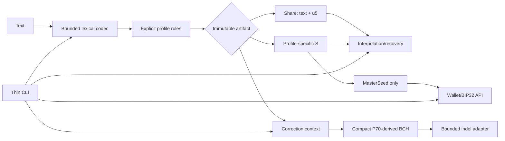

# BIP93 Reference API and CLI Completion Plan

This file preserves the accepted Gates 0–8 plan and its original planning
assessment. Live requirement status and current evidence are maintained in
`traceability.md`; Gate status is maintained in `completion-plan.md`. Gates 0–3
are complete.

## Requirements traceability matrix

Status: **Implemented**, **Partial**, **Noncompliant**, **Missing**, or **Deliberately deferred**.

Source key:

- [B93 — BIP93](https://github.com/bitcoin/bips/blob.com/bitcoin/bips/blob/master/bip-0093.mediawiki)
- [W — wallet integration guidance](https://github.com/BlockstreamResearch/codex32/blob/master/docs/wallets.md)
- [B — illustrated booklet](https://secretcodex32.com/docs/2023-03-07--bw.pdf)
- [S — secretcodex32 website](https://secretcodex32.com/)
- [P70 — correction PR](https://github.com/BlockstreamResearch/codex32/pull/70)
- [RR — incomplete Rust reference](https://github.com/BlockstreamResearch/codex32/tree/master/reference/rust-codex32)
- [CL — Core Lightning `exposesecret`](https://docs.corelightning.org/reference/exposesecret)
- [B388 — wallet policies](https://github.com/bitcoin/bips/blob/master/bip-0388.mediawiki)

| ID | Source section | Normative/functional requirement | Current code | Current tests | Status | Evidence | Remaining work |
|---|---|---|---|---|---|---|---|
| R01 | B93 §codex32 | Single-case Bech32 characters, separator, threshold, four-character identifier, index, payload and checksum | `bech32_parse`, `decode`, `Codex32String` | Invalid case/header/prefix cases | Partial | Parsing generally works, but error ordering causes the current failing HRP test and the object is mutable | Centralize lexical/header validation; reject unknown HRPs before checksum interpretation; immutable artifacts |
| R02 | B93 §Checksum, §Long codex32 | For `ms`, choose short/long checksum solely from unchecksummed data-part length | `codex32_encode`, `u5_decode` | Short/long vectors only | Noncompliant | `codex32_encode` uses `len(hrp) + len(data) > 80` | Profile-owned selector; boundary tests at payload 74/75 and seed 46/47 bytes |
| R03 | B93 §Long codex32 | Short payload at most 74 symbols; long payload 75–103; 15-symbol long checksum | Generic checksum coverage plus `decode` | Long BIP93 vector | Partial | Generic coverage is broader than BIP93 | Exact profile payload/checksum ranges |
| R04 | B93 §Master seed format | `ms` supports every byte length 16–64; trailing incomplete group may have arbitrary bits | `decode`, `encode`, `.data`, `.pad_val` | Standard vectors and alternate padding | Noncompliant | `decode` rejects byte lengths not divisible by four | Accept all 49 byte lengths; preserve arbitrary parsed S padding; remove share bytes |
| R05 | B93 header rules | `k=0` requires S; `k=2…9` supports S or ordinary indices; `k=1` invalid | Parser and CLI guards | Invalid threshold/index vectors | Partial | Validation ownership is dispersed | One immutable `Header` validator |
| R06 | B93 §Checksum; W §Error Detection | Invalid-checksum strings cannot enter sharing, recovery or wallets | Constructor and CLI parsing | Checksum corruption tests | Partial | Normal paths verify, but low-level helpers and mutation undermine the boundary | Domain APIs accept validated immutable artifacts only |
| R07 | B93 §Recovering Secret | Recovery requires exactly k compatible, distinct shares | `interpolate_at` | BIP93 vectors 2 and 3 | Partial | Basic checks exist without authoritative profile semantics | Profile-aware exact-threshold recovery |
| R08 | B93 §Generating Shares | Additional shares require a fresh target index | `interpolate_at` | No rejection test | Noncompliant | Existing target returns the input | `derive_share` rejects S, existing or excluded indices; enabled for all four registered profiles |
| R09 | B93 fresh generation; B generation | Fresh shared secrets use k independent uniform u5 masks; shares have no byte semantics | `generation._random_mask_payloads`; immutable `Share` | All lengths, thresholds, padding balance and negative public surface | Implemented | One batched OS-CSPRNG call supplies complete u5 masks; shares expose no bytes | Gate 8 independent remapping |
| R10 | B93 existing-secret generation | Splitting S uses S plus k−1 independent uniform masks | `generation.split_secret`; `derive_share` | Exact-threshold recovery, raw/parsed S, CL and property tests | Implemented | One reviewed S-only split owner serves API and CLI | Gate 8 independent remapping |
| R11 | B93 §Error Correction; W §ECW | Correct four substitutions, mixed errors/erasures, eight erasures and consecutive erasures | `correction.py` | Strong direct correction tests | Partial | Promising P70-derived behavior, but 1,471 lines and little independent validation | Compact differential-tested BCH core |
| R12 | B93/W correction trust | Corrections are suggestions and are never silently used | `correct` warning/output | Warning assertions only | Noncompliant | Current command emits successful stdout; API hides ties/completeness | Suggestions go to stderr with nonzero status; API returns all best ties only after complete search |
| R13 | W §Import Support | Later shares use known HRP, length, threshold, identifier and unused index | Generic multi-token stdin | None | Missing | Current input asks for all strings together | Sequential prompt with profile and five-character `k+identifier` prefill |
| R14 | W §Import Support | Uppercase windows, `?`, ten-second default search limit and candidate confirmation | Pretty helpers and timed search | Presentation and timeout tests | Partial | Deadline excludes some work and candidate status lacks proof/completeness | End-to-end deadline; display best provisional candidate on timeout, clearly marked unproven |
| R15 | W final import; B93 §Not BIP39 Entropy | Only `ms` S enters wallet workflows and its bytes are used directly as BIP32 seed | `_master_node` | Official xprv vectors | Implemented but weakly typed | CLI checks HRP, but all strings expose bytes | Wallet API accepts only `MasterSeed` |
| R16 | B generation/verification | Electronic generation defaults to 128 bits; manual verification requirement is specific to hand computation | `generate_master_seed`; thin `create` route | Full create generation matrix | Implemented | The API owns reviewed generation and CLI defaults to 16 bytes | Gate 6 installed CLI polish |
| R17 | B worksheets; CLI safety contract | `checksum` accepts only worksheet-defined `ms` 128/256 or fixed `cl` payload; default profile is `ms` when prefix omitted | `_worksheet_*`, `checksum` | 128-bit and invalid-index tests | Partial | Only 128-bit `ms` implemented | Profile-aware checksum API and strict CLI; omitted prefix means `ms`, explicit `cl1` selects CL |
| R18 | B93 identifiers; electronic-generation discussion | Identifier is public metadata; initial fingerprint defaults and re-share set separation are explicit | generation full-20/legacy 10+10 helpers and metadata-only fallback | Frozen fixtures, collision/payload preservation and excluded-header tests | Accepted divergence | About 20 seed-derived bits are public; the risk and `k−1` guessed-S predicate are explicit and audited | Gate 8 accepted-risk revalidation |
| R19 | CL docs/implementation | `cl`: custom identifier, fixed 32-byte payload and short HRP-aware codex32 checksum | Generic alternate-HRP support | Three CL examples | Noncompliant | Arbitrary lengths accepted and identifiers mutable | Dedicated CL profile and official vectors |
| R20 | BIP39 worksheets/FAQ | Fixed 132/264-bit payloads; CLI migration-only verification and S recovery; API may recover and derive additional shares | None beyond generic HRP parsing | None | Missing | No fixed length, padding or embedded BIP39 checksum validation | Isolated validators; API `recover_secret` and `derive_share`; CLI only `verify` and `secret` |
| R21 | Locked profile policy | Unknown HRPs are rejected; no fallback to `ms` checksum or length rules | Generic parser accepts arbitrary HRP | Alternate-HRP test | Noncompliant | Unknown strings can reach checksum and interpolation | Immutable four-profile registry |
| R22 | Generation invariant | Machine-generated `ms` S uses selected CRC padding; parsed BIP93 strings accept arbitrary padding | private `_crc_pad`, S factory and generation rejection | Frozen CRC behavior, all lengths and arbitrary parsed padding | Implemented | CRC is generation-only S padding and never share/validity semantics | Gate 8 independent verification |
| R23 | Electronic generation | Machine-created share sets default to random distinct output indices | `SystemRandom.sample` selection owner | distinct/count/all-31 and explicit order tests | Accepted divergence | Sampled and requested order are preserved without sorting | Gate 8 independent verification |
| R24 | Speculation only | Partial-basis completion is not a production requirement | Not implemented | None | Deliberately deferred | No authoritative contract | Research backlog only |
| R25 | Wallet functionality | `xprv`, coordinator BIP48 xpub with origin, and descriptors belong in reusable API | `xprv`, `descriptors`; xpub detached | xprv vectors; descriptor checksum only | Partial | No xpub command and wallet logic lives in CLI | Add narrow wallet API and `xpub --account` |
| R26 | Bitcoin Core descriptors | Private descriptors may intentionally contain root xprv plus path; account/timestamp explicit | Descriptor helpers and local account DB | None | Partial | Root behavior matches Core; hidden DB is racy and `timestamp="now"` unsafe for recovery | Keep documented root behavior; remove DB; default timestamp 0 |
| R27 | B388 | Trusted templates may use BIP388 rendering; toy parser is not an arbitrary security parser | `wallet_policies.py`, `make_private_descriptor` | Descriptor checksum only | Partial | Arbitrary conversion relies on toy parser | Minimal trusted-template renderer; remove arbitrary conversion |
| R28 | RR, packaging and auditability | Public API must be safe, typed, installable and directly traceable | `__init__`, `pyproject`, monolithic CLI | Direct `CliRunner` tests | Noncompliant | No console script, Click undeclared, CI version mismatch and unsafe exports | Typed API, installed CLI tests, aligned dependencies/CI and migration docs |

## Overall implementation status

After Gates 0–3, the codec, typed artifacts, profile rules, sharing and reviewed
electronic generation form a strong reference-API foundation. The repository is
still not production-ready because correction, the installed CLI contract and
wallet API remain later gates.

- Checksum arithmetic, official-vector parsing, interpolation, direct BIP32 derivation and the P70-derived BCH behavior are substantial foundations.
- Immutable typed artifacts and a closed profile registry now enforce S/share
  and unknown-HRP boundaries.
- Every 16–64-byte `ms` size works and checksum selection is data-part-only.
- Generation is independently reviewed, OS-CSPRNG backed and shared by API/CLI.
- Correction remains functional but too large and policy-heavy for final review.
- Click is declared directly, but the CLI still lacks its installed entry point,
  contains non-generation domain logic and maintains hidden wallet-account state.
- Current Gate 3 baseline: **287 tests pass**.

## CLI coverage and required contract

| Command | `ms` | `cl` | `bip39_12w` / `bip39_24w` | Unknown |
|---|---:|---:|---:|---:|
| `verify` | Yes | Yes | Yes | Reject |
| `secret` | Yes | Yes | Yes, including recovery from shares | Reject |
| `share` | Yes | Yes | Reject | Reject |
| `create` | Yes; default profile and 128-bit default | Yes; fixed 32 bytes | Reject | Reject |
| `checksum` | 128/256-bit worksheets only; default when prefix omitted | Fixed 32-byte payload with explicit `cl1` | Reject | Reject |
| `correct` | Yes; default profile | Yes, lower priority | Reject | Reject |
| `xprv`, `xpub`, `descriptors` | Yes, S-only | Reject | Reject | Reject |

Exact CLI behavior:

- `correct` always writes its suggestion to **stderr** and exits nonzero by default.
- If the search times out before proving optimality but found a candidate, display it on stderr as “best found before timeout”; explicitly state that a closer or tied candidate may exist.
- `--accept-candidate` may emit canonical stdout/status 0 only for a candidate whose best rank was proven. A provisional timeout candidate can still be copied and independently checked, but cannot use the accepted machine-output path.
- The API never returns a provisional or incomplete candidate set.
- `correct` defaults to `ms`, never corrects the HRP, and accepts an expected header of exactly five characters: threshold plus identifier.
- `checksum 2namea` is interpreted as `ms12namea`; `checksum ms12namea` is equivalent. An explicit `cl12namea` selects the CL profile. Unknown explicit prefixes fail.
- When no header argument is supplied, worksheet input may likewise omit `ms1`; explicit non-`ms` input must include its registered prefix.
- `secret` accepts BIP39 S directly or exactly k compatible BIP39 shares, recovers S, validates the embedded BIP39 checksum and prints canonical S. It never produces a mnemonic or derives the BIP39 wallet.
- Recovery input is sequential on a TTY. After the first share, prompt with `hrp1` plus `k+identifier`; index remains user-entered and must be fresh.
- CLI default correction target lengths are 128/256-bit `ms`; unusual 16–64-byte lengths require an explicit expected byte length.
- Default correction deadline is 10 seconds and may be extended explicitly.
- `create` defaults to random distinct output indices; `--indices` gives an exact set. Partial-basis input is rejected.
- Remove `mlockall`; do not claim CPython memory zeroization or guaranteed locking.
- Remove the hidden account database; account and timestamp are explicit inputs.
- Add `[project.scripts] codex32 = "codex32.cli:cli"` and declare Click directly.

## Security and auditability conclusions

1. **Typed S/share boundaries are foundational.** Shares expose canonical text and complete u5 symbols only. Profile-specific S types alone expose semantic bytes.

2. **Fingerprint identifiers remain with explicit tradeoffs.**

   - Initial fresh and unshared `ms` generation uses the first 20 BIP32-fingerprint bits.
   - Splitting a typed/parsed `MasterSeed` uses 10 master-fingerprint bits plus
     the existing non-domain-separated 10-bit fingerprint of canonical A/C/D…
     payloads. Raw bytes require an explicit identifier.
   - With `k-1` genuine shares, a guessed S fixes the polynomial and permits
     evaluation of the full 10+10 predicate; `k` genuine shares are not needed.
   - Fingerprint defaults are a medium accepted disclosure that weakens the
     information-theoretic `<k` claim. They are never described as a security
     enhancement.
   - Explicit set-header collisions fail before mask entropy. A colliding
     derived default keeps the accepted basis and randomizes only its public
     identifier; exclusions are bounded to 1,024 five-symbol set headers.
   - No practical recovery attack was demonstrated for uniformly generated
     128-bit-or-larger seeds, but linkage, reduced brute-force margin, and the
     weak-seed oracle remain real residual risks.

3. **Root-xprv private descriptors remain deliberately.** Bitcoin Core’s behavior is intentional. The command must clearly state that its output has root authority. Coordinator xpub output never contains private material.

4. **BIP388 parsing is narrowed.** Keep trusted standard policy rendering and descriptor checksum provenance; remove arbitrary descriptor rewriting.

5. **`python-bip32` remains behind a narrow adapter.** Pin `bip32>=5,<6`, verify official vectors under normal and optimized Python, and document that dependency audit evidence is limited.

6. **Correction completeness is interface-specific.**

   - API: untimed complete bounded search; all best-rank ties; no incomplete result.
   - CLI before timeout/proof: first proven-optimal suggestion is enough; equal ties need not all be found.
   - CLI on timeout: display the best candidate found as an explicitly provisional diagnostic on stderr, return nonzero, and disable `--accept-candidate`.
   - Every correction remains untrusted until checked against the physical backup.

7. **Estimated search-space bits remain the API rank.** Common character confusions may affect CLI presentation ordering only. The weighted distance from `wallets.md` is a documented deliberate divergence.

8. **All byte lengths 16–64 remain supported.** The unmerged/closed [BIP PR 2077](https://github.com/bitcoin/bips/pull/2077) is future ECW performance research only.

## Target architecture and public API

Public surface:

- `parse_codex32(text) -> Share | Secret`
- `complete_checksum(unchecksummed_text) -> Share | Secret`, only for construction-enabled profiles
- Immutable `Header(threshold, identifier, index)`
- `Share` exposes `text`, `header`, `profile`, `payload_symbols`; no bytes, padding setter or byte factory
- `MasterSeed` exposes `seed_bytes`; `MasterSeed.from_seed(...)` always creates S and uses internal generation padding
- `CoreLightningSecret` exposes its fixed 32-byte HSM secret and uses canonical zero padding when constructed
- BIP39 S exposes canonical text/symbols only; no mnemonic, raw entropy or wallet derivation API
- `recover_secret(shares) -> Secret` for all four profiles
- `derive_share(shares, fresh_index) -> Share` for all four profiles, including BIP39; CLI/GUI capability policy does not expose BIP39 derivation
- `split_secret(secret, threshold, *, share_count|indices, identifier=..., excluded_headers=...)` only for `ms` and `cl`, threshold 2–9; BIP39 does not gain fresh splitting/generation
- `generate_master_seed(...)` and `generate_core_lightning_secret(...)`; profile-specific generation alone owns threshold zero, and no public injectable RNG exists
- `CorrectionContext(profile, expected_length, expected_header=None, excluded_indices=...)`
- `correct(context, damaged_text) -> tuple[CorrectionCandidate, ...]`; complete, deterministic and containing all best-rank ties
- `correct_worksheet_residue(...)`, restricted to published worksheet sizes
- Wallet API accepting only `MasterSeed`: `master_xprv`, `multisig_account_xpub`, `core_descriptors`

Unsafe exports removed without compatibility shims:

- Generic `encode(hrp, header, bytes, pad_val)`
- Non-S `from_seed`
- `.data` on shares
- Mutable HRP/header/padding fields
- Arbitrary-HRP parsing/interpolation
- Arbitrary descriptor-to-private conversion

## Prioritized remaining work

1. Freeze source requirements and restore a green honest baseline.
2. Introduce immutable profile-aware S/share types.
3. Correct all `ms` lengths/checksum boundaries and implement CL/BIP39 profiles.
4. Rebuild interpolation, recovery and all-profile additional-share derivation.
5. Implement and independently audit secure fresh generation, the frozen compact CRC convention, identifiers and random indices.
6. Rewrite the P70 BCH core.
7. Add bounded structural correction and explicit complete/provisional result states.
8. Refactor and package the CLI.
9. Move BIP32, xpub and descriptor functionality into a stateless wallet API.
10. Complete security, dependency and clean-wheel release verification.

# Implementation gates

No later gate begins until every success criterion and verification command in the current gate passes. Existing tests may be removed only when stronger normative and negative coverage replaces them in the same gate.

## Gate 0 — Freeze evidence and restore the baseline

1. **Objective:** Establish authoritative requirements, source revisions and a green baseline without treating README as authoritative.

2. **Requirements/spec sections:** Matrix R01–R28 inventory; current R01 failure; provenance for all named sources.

3. **Expected files/modules:** `docs/traceability.md`, `docs/divergences.md`, test data; minimal parser/error-ordering correction.

4. **Tests required:** Preserve all collected tests; fix invalid-HRP behavior in implementation; classify CLI/correction tests; retain unsafe round-trip test until Gate 1 replaces it.

5. **Security/invariants:** Preserve existing worktree changes; no skips, `xfail`, broadened exceptions or regenerated expectations from the code under test.

6. **Success criteria:** Full suite green; every matrix row has an owner and frozen source; divergences explicit.

7. **Verification commands:**

   - `git status --short`
   - `python -m pytest --collect-only -q`
   - `python -m pytest -q`
   - `git diff --check`

8. **Artifacts/documentation:** Source manifest, initial traceability matrix, divergence ledger and baseline report.

9. **Dependencies:** None.

## Gate 1 — Immutable codec, artifacts and profiles

1. **Objective:** Give profile, checksum, header and S/share semantics one authoritative owner.

2. **Requirements/spec sections:** R01–R06, R19–R21, R28; B93 format/checksum/long/master-seed sections; CL; BIP39 worksheets.

3. **Expected files/modules:** `bech32.py`, `checksums.py`, `profiles.py`, isolated `bip39.py`, `bip93.py`, `__init__.py`; remove unrelated address code after preserving useful vectors.

4. **Tests required:**

   - All official BIP93 vectors.
   - Every `ms` byte length 16–64 and every legal trailing padding.
   - Payload 74/75 and seed 46/47 boundaries.
   - Official CL examples.
   - BIP39 exact payload lengths, padding and embedded checksum.
   - Unknown HRP rejection and immutability.
   - Negative proof that shares have no byte API.
   - Replace unsafe round-trip tests with symbol-level and negative tests.

5. **Security/invariants:** Only registered profiles interpret checksum/payload rules; `ms` selection uses data length only; BIP39 SHA remains isolated.

6. **Success criteria:** Immutable artifacts only; no generic byte encoder; all profile vectors pass; unknown profiles cannot reach domain operations.

7. **Verification commands:**

   - `python -m pytest -q tests/test_bech32.py tests/test_bip93.py tests/test_profiles.py`
   - `python -O -m pytest -q tests/test_bip93.py tests/test_profiles.py`
   - `python -m mypy src/codex32`

8. **Artifacts/documentation:** Architecture map, API migration table and profile capability table.

9. **Dependencies:** Gate 0.

## Gate 2 — Interpolation, recovery and additional-share derivation

1. **Objective:** Implement symbol-level BIP93 operations for every registered linear profile.

2. **Requirements/spec sections:** R07, R08, R10, R20; B93 recovery and existing-share generation.

3. **Expected files/modules:** `bip93.py`, `profiles.py`, `tests/test_sharing.py`.

4. **Tests required:**

   - Official derive/recovery vectors.
   - Exact thresholds k=2…9.
   - Mismatched profile, threshold, identifier, length and duplicate-index rejection.
   - Existing-target, S-target and excluded-index rejection.
   - `derive_share` for `ms`, `cl`, `bip39_12w` and `bip39_24w`.
   - BIP39 recovered S validates its embedded checksum; ordinary BIP39 shares are validated structurally only.
   - Unknown profiles rejected.
   - Property tests over all valid indices and `ms` lengths.

5. **Security/invariants:** Interpolation uses complete u5 arrays; additional BIP39 share derivation is API-only and does not enable BIP39 generation, checksum completion or wallet recovery.

6. **Success criteria:** One interpolation implementation; all four registered profiles recover and derive correctly; CLI policy is not embedded in domain code.

7. **Verification commands:**

   - `python -m pytest -q tests/test_sharing.py tests/test_bip93.py`
   - `python -m pytest -q --hypothesis-show-statistics tests/test_sharing.py`

8. **Artifacts/documentation:** Recovery/derivation capability table and rejected-mismatch examples.

9. **Dependencies:** Gate 1.

## Gate 3 — Audited generation, CRC, identifiers and random indices

1. **Objective:** Make electronic `ms`/CL generation uniform, bounded, directly
   traceable, and independently audited before and after implementation.

2. **Requirements/spec sections:** R09, R10, R16, R18, R22–R24; B93
   fresh/existing generation and Book electronic generation.

3. **Expected files/modules:** New `generation.py`; small updates to API/errors,
   CRC documentation, CLI routing, dependency pins, generation/CRC tests, and
   `docs/security/generation/`.

4. **Security review and implementation:**

   - Gate 3A must accept the design before production edits. The accepted
     revision caps and snapshots set-header exclusions at 1,024 entries and
     restricts `split_secret` to thresholds 2–9.
   - One attempted hidden basis obtains every mask symbol from one direct
     `secrets.token_bytes` call and unbiased `byte & 31` mapping.
   - Fresh generation samples `k` masks; existing S splitting samples `k-1`.
     CRC/zero-pad rejection is the only fresh-basis rejection.
   - Explicit collisions fail before mask entropy. Derived-default collisions
     keep the accepted basis and randomize only the identifier metadata.
   - `SystemRandom.sample` selects a uniform ordered subset of the fixed 31
     ordinary indices. Explicit and sampled order are never sorted.
   - Raw `ms` bytes and all CL inputs require an explicit identifier. The
     reviewed full-20/legacy 10+10 defaults are a medium accepted disclosure,
     not a security enhancement.
   - Partial-basis and BIP39 generation remain unreachable.

5. **CRC decision:** Preserve the compact private CRC1–CRC4 table and freeze its
   complete bit convention. Cite the Koopman catalogue without claiming its
   low-independent-bit-error rankings prove optimality for human transcription.
   Do not add a selector tool, polynomial enumeration, or selection tests.

6. **Tests required:** All 49 `ms` lengths; thresholds 2–9; raw/parsed S; CL;
   selector and order bounds; all-31 permutation invariant; padding integration;
   exact threshold recovery; frozen full-20 and 10+10 fixtures; bounded
   set-header collisions and unchanged fallback payloads; BIP39/partial-basis
   rejection; public signatures without entropy controls; a small algebraic
   padding-balance proof. Tests never replace or patch entropy.

7. **Success criteria:** One reviewed generation owner serves API and CLI; no
   entropy substitution exists; accepted masks survive metadata fallback;
   output order is preserved; raw inputs cannot receive fingerprint defaults;
   partial bases are unreachable; all verification passes; a separate Gate 3C
   diff audit has no unresolved medium-or-higher finding.

8. **Verification commands:**

   - `python -m pytest -q tests/test_generation.py tests/test_crc.py tests/test_cli.py`
   - `python -m pytest -q --hypothesis-show-statistics tests/test_generation.py`
   - `python -O -m pytest -q tests/test_generation.py tests/test_crc.py tests/test_bip93.py`
   - `python -m mypy src/codex32`
   - `python -m ruff check src/codex32 tests/test_generation.py tests/test_crc.py`
   - `python -m pytest -q`
   - public-export smoke check and `git diff --check`

9. **Artifacts/documentation:** Generation guide, exact CRC convention,
   identifier disclosure analysis, revised divergence/traceability maps, Gate
   3A review package, and Gate 3C audit record.

10. **Dependencies:** Gates 1–2. Gate 4 waits for the accepted Gate 3C record.

## Gate 4 — Compact P70-derived BCH correction core

1. **Objective:** Preserve algebraic correction while making provenance and code mapping directly reviewable. Use zero-based reverse coordinates throughout; reverse index 0 is the final symbol.

2. **Requirements/spec sections:** R11, R17; B93 error correction; W ECW requirements; P70 and worksheet correction.

3. **Expected files/modules:** Rewritten `correction.py`, shared `gf32.py`, internal transitional `indel.py`, P70 fixtures, `tests/test_correction_bch.py`.

4. **Tests required:**

   - One through four substitutions for short and long checksums.
   - Every `2*errors + erasures <= 8` distribution.
   - Eight arbitrary and consecutive-erasure limits.
   - Mixed case, wrong HRP, out-of-body worksheet positions and uncorrectable inputs.
   - Frozen source-derived differential fixtures against P70; no duplicate polymod implementation.
   - Generic 13/15-symbol worksheet residue correction with period-relative reverse indices and no application/string-length input.
   - Fixed-string correction for `ms`, CL, `bip39_12w`, and `bip39_24w`, followed by normal semantic reparse.
   - Published BIP39 worksheet residues without BIP39-specific residue code.

5. **Security/invariants:** HRP and separator never enter correction positions; selected profile and semantic validation are mandatory for full strings; residue mode learns no HRP or shortened length; no share byte construction.

6. **Success criteria:** Existing valid BCH fixtures pass; direct P70 port is visibly separated from local adapters; `correction.py` is at most 650 physical lines; structural policy is isolated for Gate 5.

7. **Verification commands:**

   - `python -m pytest -q tests/test_correction_bch.py`
   - `python -O -m pytest -q tests/test_correction_bch.py tests/test_profiles.py tests/test_bip39.py`
   - `python tools/differential_correction.py --verify`

8. **Artifacts/documentation:** Provenance/license notice, algebra-to-function map, correction-capacity table, worksheet privacy contract, and focused audit record.

9. **Dependencies:** Gates 1–3.

## Gate 5 — Bounded structural correction and result states

1. **Objective:** Add useful insertion/deletion recovery without reproducing the current heuristic complexity.

2. **Requirements/spec sections:** R12–R14; W import steps 1–5 and optional indels.

3. **Expected files/modules:** New `indel.py`, small `correction.py` integration, context/result types and structural tests.

4. **Tests required:**

   - Complete search through four total arbitrary insertions/deletions at exact target length.
   - Missing characters materialized as `?`.
   - Fast paths for adjacent duplicates and omitted/duplicated groups, including up to eight extra duplicated characters.
   - Character and complete-group transpositions.
   - Five-character expected header constraint; six characters rejected.
   - Excluded indices rejected.
   - API returns all best-rank ties in deterministic order.
   - Proven-optimal CLI result state.
   - Timeout with candidate returns a distinct provisional state containing the best found candidate and “optimality not proven”.
   - Timeout without candidate returns no suggestion.
   - Ranking research evaluates estimated search-space bits, filled erasures, and for each known substitution the addend bit count plus the number of plausible source characters; the sum/product composition, precedence, units, and tie semantics must be justified before implementation.
   - Worst-case time and memory benchmarks.

5. **Security/invariants:** Provisional candidates never enter the complete API result or accepted stdout path. They may be shown only as clearly labelled stderr diagnostics with nonzero status.

6. **Success criteria:** `correction.py` plus `indel.py` remain under 1,000 physical lines; every result says whether optimality was proven; no undocumented weighted model.

7. **Verification commands:**

   - `python -m pytest -q tests/test_correction_bch.py tests/test_correction_indel.py`
   - `python tools/benchmark_correction.py --verify docs/correction-budgets.json`
   - `python tools/check_correction_size.py --max-lines 1000`

8. **Artifacts/documentation:** Search envelope, complexity estimates, result-state contract and ranking divergence rationale.

9. **Dependencies:** Gate 4.

## Gate 6 — Thin installed core CLI

1. **Objective:** Deliver stable non-wallet commands as bounded adapters over the completed API.

2. **Requirements/spec sections:** R12–R23 and R28; W sequential import flow; locked CLI matrix.

3. **Expected files/modules:** Refactored `cli.py`, `pyproject.toml`, installed CLI tests and direct Click dependency.

4. **Tests required:**

   - Subprocess tests against installed `codex32`.
   - Every permitted/prohibited command/profile combination.
   - BIP39 `secret` from an input S and from exactly k shares.
   - CLI `share` rejects BIP39 even though API `derive_share` supports it.
   - `ms` create default 128 bits and explicit 16–64-byte lengths.
   - CL fixed-size creation.
   - `checksum 2namea` defaults to `ms`; explicit `ms1` is equivalent; explicit `cl1` selects CL; unknown prefixes fail.
   - Checksum size/header/canonical-index restrictions.
   - Sequential TTY prefilling and duplicate rejection.
   - Bounded stdin before allocation.
   - Proven correction suggestion: stderr/nonzero by default; accepted stdout only with `--accept-candidate`.
   - Timeout provisional candidate: labelled stderr/nonzero; `--accept-candidate` rejected.
   - Timeout with no candidate and no-correction cases have distinct diagnostics/status.
   - Existing official CLI vectors do not regress.

5. **Security/invariants:** CLI has no domain algorithms, hidden state, `mlockall` or secret command-line arguments; stdout is reserved for deliberately accepted machine output.

6. **Success criteria:** Clean-wheel executable works; help matches the capability matrix; CLI remains a thin presentation layer targeted below 600 lines.

7. **Verification commands:**

   - `python -m build`
   - `python -m pytest -q tests/test_cli_contract.py`
   - `python -m pip install --no-deps --force-reinstall dist/codex32-*.whl`
   - `codex32 --help`
   - `codex32 --version`

8. **Artifacts/documentation:** CLI manual, checksum prefix/default examples, stderr/stdout/exit-code contract and offline handling guidance.

9. **Dependencies:** Gates 1–5.

## Gate 7 — Wallet API, xpub and descriptors

1. **Objective:** Move reusable wallet functionality out of the CLI and restore coordinator xpub support.

2. **Requirements/spec sections:** R15, R18, R25–R27; direct BIP32 use, B388 trusted rendering and Bitcoin Core private descriptors.

3. **Expected files/modules:** New `wallet.py`, simplified `descriptor.py`, CLI routing; remove hidden state, arbitrary conversion and unnecessary parser code.

4. **Tests required:**

   - Official BIP32 and BIP93 xprv vectors.
   - Reject CL, BIP39 and ordinary shares at wallet boundary.
   - Golden BIP48 native-SegWit coordinator xpubs with origins.
   - Public and private descriptor fixtures.
   - Private descriptors contain root xprv plus exact path.
   - Descriptor checksums and trusted templates.
   - Timestamp 0 default and explicit account/timestamp determinism.
   - No account DB access.
   - Normal and `python -O` dependency-wrapper tests.

5. **Security/invariants:** Wallet API accepts only `MasterSeed`; private output is explicitly root authority; public coordinator output never includes private material.

6. **Success criteria:** `xprv`, `xpub` and `descriptors` are thin calls into one stateless wallet API; dependency assessment complete.

7. **Verification commands:**

   - `python -m pytest -q tests/test_wallet.py tests/test_descriptor.py tests/test_cli_wallet.py`
   - `python -O -m pytest -q tests/test_wallet.py`
   - `python tools/verify_wallet_fixtures.py`

8. **Artifacts/documentation:** Wallet guide, derivation table, authority warning, BIP32 assessment and Core behavior citation.

9. **Dependencies:** Gates 1–3 and 6.

## Gate 8 — Independent audit and release readiness

1. **Objective:** Prove the API/CLI artifact is reproducible, traceable and ready for a later GUI.

2. **Requirements/spec sections:** Every non-deferred matrix row; R24 remains outside v1.

3. **Expected files/modules:** CI, `SECURITY.md`, `CHANGELOG.md`, dependency constraints, final documentation and release metadata.

4. **Tests required:**

   - Full unit/property/differential/CLI/wallet suites on Python 3.12–3.14.
   - Bounded malformed-input corpus.
   - Correction performance and memory budgets.
   - Clean sdist/wheel installation.
   - Dependency vulnerability/license/hash review.
   - Security-finding and accepted-risk revalidation.
   - Independent human mapping from every matrix row to an owning function and test.

5. **Security/invariants:** No medium-or-higher unaccepted finding; no unsafe compatibility shim; CPython memory and timing limits stated honestly.

6. **Success criteria:** Matrix rows are Implemented, Deliberate Divergence or Explicit Non-goal; all CI and clean-wheel checks pass; correction size budget passes; no GUI begins before acceptance.

7. **Verification commands:**

   - `python -m pytest -q`
   - `python -m pytest -q --hypothesis-show-statistics`
   - `ruff check .`
   - `ruff format --check .`
   - `mypy src`
   - `python -m build`
   - `twine check dist/*`
   - `python tools/check_traceability.py`
   - `python tools/benchmark_correction.py --verify docs/correction-budgets.json`
   - `git diff --check`

8. **Artifacts/documentation:** Final traceability matrix, architecture/security review, threat model, accepted-risk register, migration guide, CLI manual, release checklist and source/dependency manifest.

9. **Dependencies:** Gates 0–7.

**Review hold:** implementation must not begin until this revised gate sequence and interface contract are accepted.
